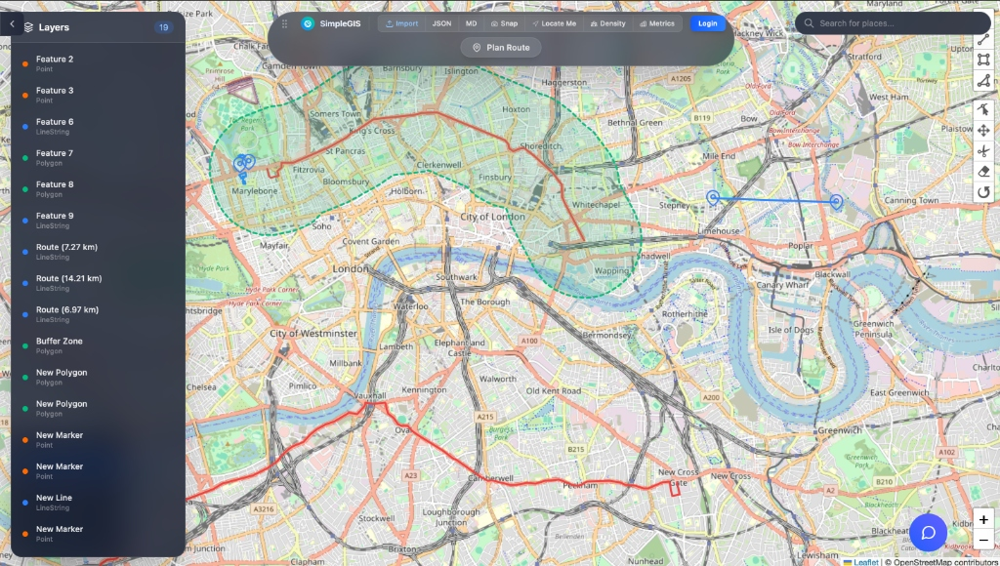

# LiteGIS

A modern, full-stack Geographic Information System (GIS) built with React, Leaflet, and Express. LiteGIS allows you to draw, analyze, and manage spatial data with a sleek, glassmorphic user interface.

## Features

- **Interactive Mapping:** Draw Points, Lines, and Polygons directly on the map using Leaflet-Geoman.
- **Layer Management:** A dedicated sidebar to view, toggle visibility, edit colors, name, and delete individual features.
- **Dynamic Basemaps:** Switch between standard OSM, Satellite, Dark Mode, and Topographic map layers.
- **Geocoding Search:** A built-in search bar powered by OpenStreetMap's Nominatim API. Search for any address or landmark and instantly "fly" to its location.
- **Routing & Navigation:** Calculate real-world driving routes between multiple points using the OSRM backend. 
- **Real-time Geolocation:** Click "Locate Me" to jump to your current GPS position. Follow mode ensures the map moves with you.
- **Spatial Analysis (Turf.js):**
  - **Analytics Dashboard:** Real-time calculation of enclosed areas (sq km) and path lengths (km). Includes a donut chart visualization of feature types.
  - **Hexbin Density Mapping:** Generate a hex-grid heatmap to visualize the density of your plotted points.
  - **Spatial Buffering:** Automatically generate a 500-meter buffer polygon around any point, line, or polygon with the click of a button.
  - **Elevation Profiling:** Generate 3D terrain cross-sections along drawn lines using the OpenTopoData API. *(Note: Due to public API limits, elevation profiles are capped at 100 sample points per line).*
- **Custom Point Icons:** Swap the default blue pin for highly recognizable symbols (e.g., Star, Hospital, Alert, Target) that inherit your custom colors.
- **Data Export & Import:** 
  - Import GeoJSON and KML files via Drag-and-Drop or the Import menu.
  - Export your map to GeoJSON, Markdown, or a high-resolution PNG snapshot.
- **Heavy Rain Run-off Simulation:** Simulate and visualize water flow accumulation during heavy rain based on real-world elevation data (Mapzen Terrarium RGB tiles) and live precipitation data from the Open-Meteo API.
- **Light & Dark Mode:** Fully cohesive Light and Dark modes. The application UI and map tiles (OSM for Light, Carto Dark Matter for Dark) synchronize automatically to match your chosen aesthetic.
- **AI Chat Assistant:** A built-in LLM interface (Ollama) to help answer questions about the map or GIS concepts.
- **Authentication:** Foundation built for GitHub OAuth.

## Getting Started

### Docker Deployment (Recommended)
The easiest way to run LiteGIS is via Docker Compose, which handles all dependencies (Nginx, Node, SQLite) automatically:
1. Ensure you have Docker and Docker Compose installed.
2. Run `docker-compose up -d --build` in the root directory.
3. Access the app at `http://localhost:8080`.
*(Note: Your map data is safely persisted in a Docker volume).*

### Prerequisites
- Node.js (v18+)
- SQLite3
- Ollama (Optional, for the AI Chat Assistant)

### Backend Setup
1. Navigate to the `backend` directory: `cd backend`
2. Install dependencies: `npm install`
3. Start the server: `npm start`
   - The backend runs on `http://localhost:3001`

### Frontend Setup
1. Navigate to the `frontend` directory: `cd frontend`
2. Install dependencies: `npm install`
3. Start the Vite development server: `npm run dev`
   - The frontend runs on `http://localhost:5173`

## Usage

1. **Drawing:** Use the toolbar on the left side of the map to draw points, lines, or polygons.
2. **Editing:** Double-click any feature on the map, or click it in the Layer Sidebar on the left, to open the properties drawer. Here you can change its color, icon, name, and description.
3. **Searching:** Use the search bar in the top-right corner to find specific addresses or cities.
4. **Analysis:** 
   - Click "Metrics" in the top toolbar to open the Analytics Dashboard.
   - Click "Density" to toggle the hexbin heatmap.
   - Hover over a layer in the Sidebar and click the concentric circles icon to generate a spatial buffer.
5. **Routing:** Click "Plan Route" in the top toolbar, then click on the map to define waypoints. Double-click to finish and calculate the route.

## Tech Stack
- **Frontend:** React (Vite), Tailwind CSS, React-Leaflet, Leaflet-Geoman, Recharts, Turf.js
- **Backend:** Express, SQLite3 (better-sqlite3), Passport.js

## Future Milestones (Roadmap)

### 1. High-Res Map Export (Reporting) 📸
- **Description:** Fully implement the "Export to Image" button on the map using `html2canvas` or a Leaflet plugin.
- **Goal:** Allow users to instantly download a high-resolution PNG of their map—complete with custom polygons, elevation profiles, and flood zones—perfect for dropping into presentations or reports.

### 2. Cloud Deployment ☁️
- **Description:** Deploy the Dockerized application to the live internet.
- **Goal:** Host the backend and frontend on a cloud hosting service (like Render, Fly.io, or Railway) so the app can be accessed globally from any device, including mobile phones.

### 3. Layer Styling & Management 🎨
- **Description:** Enhance the Properties Drawer to allow manual styling and visibility toggling.
- **Goal:** Allow users to change the fill color, border color, adjust opacity, and toggle specific layers on/off (e.g., temporarily hide a flood zone to see the satellite imagery underneath).

### 4. Progressive Web App (Offline Mode) 📱
- **Description:** Convert the frontend into an installable PWA with service workers.
- **Goal:** Allow users to click "Install to Home Screen" on their phone for an app-like experience. Cache map tiles and drawn features to enable basic viewing and location tracking even without cellular service in the field.
